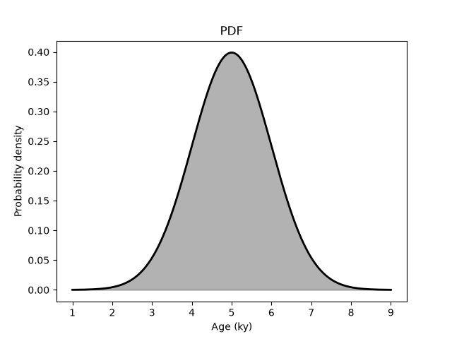
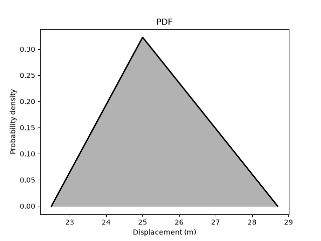
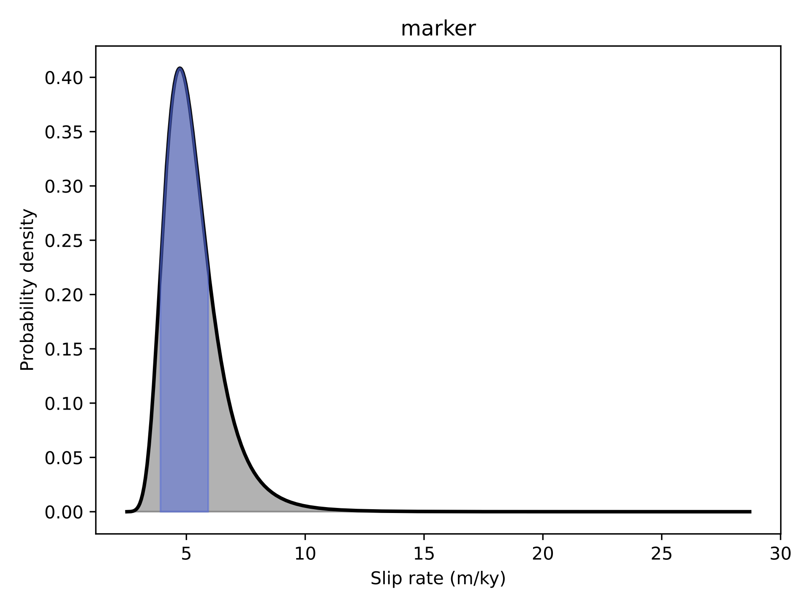

# Getting Started


## Setup

### System requirements

RISeR2 is developed and tested on macOS and Linux; it has not been tested on Windows.

It requires **Python 3.12** or above.


### Quick setup (most users)
RISeR2 is available on [PyPI](https://pypi.org/project/riser/). The simplest way to install it is to open a command prompt and simply run:

```bash
pip install riser
```

To avoid package conflicts, it is recommended to install in a separate environment. One could, for example, use [micromamba](https://mamba.readthedocs.io/en/latest/installation/micromamba-installation.html), [mamba](https://mamba.readthedocs.io/en/latest/installation/mamba-installation.html), or [conda](https://docs.conda.io/projects/conda/en/latest/user-guide/getting-started.html).


### Developer setup
If you plan to help develop the library (you totally should!), clone the repository to your local machine

```bash
git clone https://github.com/rzinke/RISeR2.git
```

change into the repo directory


```bash
cd RISeR2
```

and install the package


```bash
pip install -e ".[dev]"
```

If you have any issues with setup, post them to the [Issues](https://github.com/rzinke/RISeR2/issues) page.


## Quick start example

RISeR2 uses probability density functions (PDFs) as both inputs (*age*, *displacement*) and outputs (*slip rate*) for slip rate calculations. The simplest way to get started is to generate PDFs representing age and displacement measurements and uncertainties as parametric functions. Let's say we know the age of a displaced geomorphic feature to approximately 5.0 ka, with a 1-*sigma* uncertainty of 1.0 ky. We can create a Gaussian function as follows

```bash
riser-make-pdf -d gaussian -s 5.0 1.0 --variable-type age --unit ky -o age.txt -v -p
```

The function `riser-make-pdf` facilitates the user in creating a RISeR2-style PDF. Passing the `-h` option raises the help menu. The `-d` flag specifies the distribution type (use `-h` for list of available functions). The function parameters (in this case `mu` and `sigma`) are supplied following the `-s` flag. The output name must be explicitly specified via the `-o` flag, and the output PDF filename should end in `.txt`. It is good practice and highly recommended to specify the `variable-type` and `unit`, but not strictly necessary. The `-v` and `-p` flags are entirely optional; `-v` (`--verbose`) triggers the routines to print their operations and PDF statistics to screen, and `-p` (`--plot`) plots the results.



We can make a PDF describing the displacement as well. We will use a simple example in which the geologists report the minimum- and maximum-sedimentologically plausible bounds of 22.5 m and 28.7 m, as well as a preferred offset estimate of 25.0 m. These parameters can be represented using a triangular distribution

```bash
riser-make-pdf -d triangular -s 22.5 25.0 28.7 --variable-type displacement --unit m -o disp.txt -v -p
```



The slip rate can then be calculated from the displacement and age PDFs

```bash
riser-compute-slip-rate --age age.txt --displacement disp.txt -o quickstart/ex -v -p
```

where `quickstart/` is the folder in which the results will be stored, and `ex` is the prefix of the output files. The slip rate computation produces four files:

 - ex_marker_slip_rate.txt -- The PDF of the slip rate itself
 - ex_slip_rates.pdf -- A plot of the slip rate PDF
 - ex_markers.pdf -- A plot of the displacement-time history of the site (this will become more important when multiple dated markers are involved for incremental slip rate computation)
 - ex_slip_rate_report.txt -- A text file with a written record of the slip rate summary statistics



The slip rate units are formulated from the units of the input PDFs. Here, `m/ky` is equivalent to the more common convention of `mm/y`. The output units can be modified by adding `--age-unit-out y` and `--displacement-unit-out mm`.

The PDF produced by each of the above steps can be viewed using the `riser-view-pdf` function, e.g.,

```bash
riser-view-pdf quickstart/ex_marker_slip_rate.txt
```

Append the `--verbose` flag for a printout of the essential statistics, including the mean and standard deviation of the distribution.
